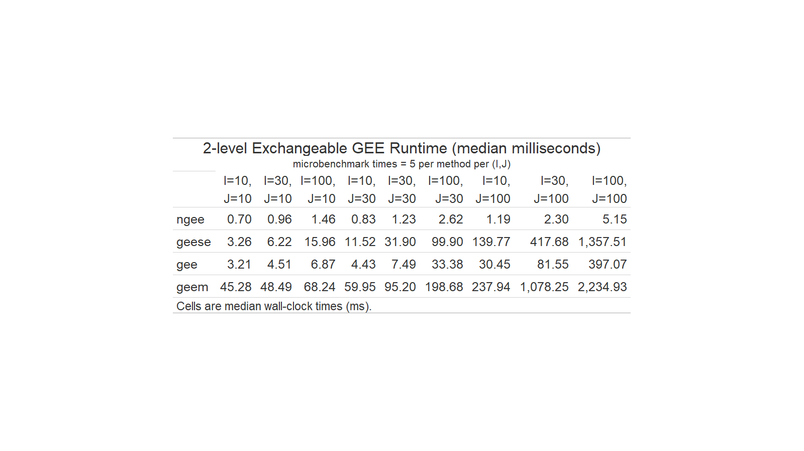

<!-- README.md is generated from README.Rmd. Please edit README.Rmd -->

**networkGEE** implements scalable generalized estimating equations (GEE) for correlated data structures that are not accommodated by classical GEE software, with support for both deterministic and stochastic fitting.

The package currently supports:

- Marginal outcome families:
  - Gaussian outcomes (`family = "gaussian"`)
  - Binomial outcomes (`family = "binomial"`)

- Working correlation structures (`corstr`):
  - Independence (`corstr = "independence"`)
  - Exchangeable / hierarchical structures:
    - Simple exchangeable GEE for 2-level clustered data  
      (`corstr = "simple-exchangeable"`, `id = "cluster_id"`)
    - Nested exchangeable GEE for 3-level hierarchical data  
      (`corstr = "nested-exchangeable"`, `id = c("outer_cluster_id", "inner_cluster_id")`)
    - Block-exchangeable GEE for closed-cohort or repeated-individual cluster-period data  
      (`corstr = "block-exchangeable"`, `id = c("cluster", "period")`)

- Fitting routines:
  - Deterministic fitting (`optim = "deterministic"`)
  - Stochastic fitting (`optim = "stochastic"`)

- Variance estimation:
  - Unadjusted sandwich standard errors (`se_adjust = "unadjusted"`)
  - Fay--Graubard adjusted standard errors (`se_adjust = "FG"`)

- Computational options:
  - Optional suppression of variance estimation for faster simulation studies (`compute_se = FALSE`)
  - Optional final deterministic refinement after stochastic fitting (`final_refine = TRUE`)

For stochastic fitting, `burnin` is the number of initial stochastic iterations discarded before averaging, and `avgiter` is the number of subsequent stochastic iterations whose parameter values are averaged. This averaging step corresponds to Polyak--Ruppert averaging. The argument `batch_size` controls the size of the subsample used at each stochastic iteration, with its interpretation depending on the chosen working correlation structure.

See Chen et al. (2025) for full methodological details.

## Installation

```{r eval=FALSE}
# install.packages("devtools")
devtools::install_github("tomchen00/networkGEE")
library(networkGEE)
```

```{r setup, include=FALSE}
library(networkGEE)
```

## Model formulation

Let \(Y_{ij}\) denote outcomes with marginal mean
```math
\begin{aligned}
\mu_{ij} = g^{-1}(\mathbf{X}_{ij}^{\top}\boldsymbol{\beta}),
\end{aligned}
```
and working covariance
```math
\begin{aligned}
\mathrm{Var}(\mathbf{Y}_i)
=
\mathbf{A}_i^{1/2}\mathbf{R}_i(\boldsymbol{\alpha})\mathbf{A}_i^{1/2},
\end{aligned}
```
where \(\mathbf{R}_i(\boldsymbol{\alpha})\) is parameterized by a low-dimensional correlation vector \(\boldsymbol{\alpha}\).

The package supports deterministic full-data fitting as well as stochastic fitting based on repeated subsampling of the observed dependence structure. In stochastic fitting, the final estimate may optionally be followed by one full-data deterministic update (`final_refine = TRUE`).

## Stochastic fitting

When `optim = "stochastic"`, the estimating equations are updated using repeated subsamples of the observed data structure rather than the full dataset at every iteration. This can substantially reduce computation time in large problems.

The main tuning parameters are:

- `batch_size`: controls the size of the subsample drawn at each stochastic iteration
- `burnin`: number of initial stochastic iterations discarded before averaging
- `avgiter`: number of subsequent stochastic iterations whose parameter values are averaged (Polyak--Ruppert averaging)
- `final_refine`: if `TRUE`, applies one final deterministic update using the full dataset after stochastic averaging

The interpretation of `batch_size` depends on the working correlation structure:

- independence / simple exchangeable: number of sampled clusters and sampled observations within cluster
- nested exchangeable: number of sampled outer clusters, sampled inner clusters, and sampled observations within inner cluster
- block-exchangeable: number of sampled clusters and sampled individuals retained across periods within cluster

In large simulation studies, it can also be useful to suppress standard error computation with `compute_se = FALSE` when only point estimation is required.

## Example 1: Independence working correlation

This is the classical working-independence GEE setting. Correlation is ignored in the working covariance, although sandwich standard errors still account for clustering.

```{r eval=FALSE}
set.seed(1729)

I <- 40
J <- 25
N <- I * J

mydat <- data.frame(
  cluster = rep(seq_len(I), each = J),
  x1 = rnorm(N),
  x2 = rbinom(N, 1, 0.5)
)

b_i <- rnorm(I, sd = 0.8)

eta_ij <- -0.4 +
  0.7 * mydat$x1 -
  0.5 * mydat$x2 +
  b_i[mydat$cluster]

p_ij <- plogis(eta_ij)
mydat$Y <- rbinom(N, size = 1, prob = p_ij)

fit_ind <- ngee(
  formula   = Y ~ x1 + x2,
  id        = "cluster",
  dat       = mydat,
  family    = "binomial",
  corstr    = "independence",
  se_adjust = "unadjusted",
  optim     = "deterministic"
)

fit_ind
```

A stochastic fit for the same model can be obtained by subsampling clusters and observations within cluster at each iteration.

```{r eval=FALSE}
fit_ind_stoch <- ngee(
  formula      = Y ~ x1 + x2,
  id           = "cluster",
  dat          = mydat,
  family       = "binomial",
  corstr       = "independence",
  se_adjust    = "unadjusted",
  optim        = "stochastic",
  batch_size   = c(20, 10),   # sampled clusters, sampled observations per cluster
  burnin       = 50,
  avgiter      = 50,
  final_refine = TRUE
)

fit_ind_stoch
```

## Example 2: Simple exchangeable GEE for 2-level clustered data

Assume clusters indexed by \(i=1,\ldots,I\) and observations within cluster indexed by \(j=1,\ldots,J_i\). Under a simple exchangeable working correlation,
```math
\begin{aligned}
\mathrm{Corr}(Y_{ij},Y_{ij'})
=
\begin{cases}
1, & j=j',\\
\rho, & j\neq j'.
\end{cases}
\end{aligned}
```

Below, `id = "cluster"` identifies the clustering variable and `corstr = "simple-exchangeable"` specifies the exchangeable working correlation.

```{r eval=FALSE}
set.seed(1729)

I <- 30
J <- 40
N <- I * J

mydat <- data.frame(
  cluster = rep(seq_len(I), each = J),
  x1 = rnorm(N),
  x2 = rbinom(N, 1, 0.5)
)

b_i <- rnorm(I, sd = 0.7)

eta_ij <- -0.5 +
  0.8 * mydat$x1 -
  0.4 * mydat$x2 +
  b_i[mydat$cluster]

p_ij <- plogis(eta_ij)
mydat$Y <- rbinom(N, size = 1, prob = p_ij)

fit <- ngee(
  formula   = Y ~ x1 + x2,
  id        = "cluster",
  dat       = mydat,
  family    = "binomial",
  corstr    = "simple-exchangeable",
  se_adjust = "unadjusted",
  optim     = "deterministic"
)

fit
```

A stochastic fit uses repeated subsamples of clusters and within-cluster observations, followed by Polyak--Ruppert averaging of the parameter iterates.

```{r eval=FALSE}
fit_stoch <- ngee(
  formula      = Y ~ x1 + x2,
  id           = "cluster",
  dat          = mydat,
  family       = "binomial",
  corstr       = "simple-exchangeable",
  se_adjust    = "unadjusted",
  optim        = "stochastic",
  batch_size   = c(20, 15),   # sampled clusters, sampled observations within cluster
  burnin       = 50,
  avgiter      = 50,
  final_refine = TRUE
)

fit_stoch
```

## Example 3: Nested exchangeable GEE for 3-level hierarchical data

Assume a 3-level hierarchy with observations indexed by \((i,j,k)\), where \(i=1,\ldots,I\) indexes outer clusters, \(j=1,\ldots,J_i\) indexes inner clusters within outer cluster \(i\), and \(k=1,\ldots,K_{ij}\) indexes individuals within inner cluster \((i,j)\). Under a nested exchangeable working correlation,
```math
\begin{aligned}
\mathrm{Corr}(Y_{ijk},Y_{ij'k'})
=
\begin{cases}
1, & j=j',\ k=k',\\
\rho_1, & j=j',\ k\neq k',\\
\rho_2, & j\neq j'.
\end{cases}
\end{aligned}
```

Below, `id = c("cluster_i", "cluster_ij")` identifies the outer and inner clustering variables.

```{r eval=FALSE}
set.seed(1729)

I <- 30
J <- 10
K <- 20
N <- I * J * K

mydat <- data.frame(
  cluster_i  = rep(seq_len(I), each = J * K),
  cluster_ij = rep(seq_len(I * J), each = K),
  x1 = rnorm(N),
  x2 = rbinom(N, 1, 0.5),
  x3 = rnorm(N)
)

u_i  <- rnorm(I, sd = 2)
v_ij <- rnorm(I * J, sd = 1)

eta_ijk <- -0.3 +
  0.7 * mydat$x1 -
  0.5 * mydat$x2 +
  0.4 * mydat$x3 +
  u_i[mydat$cluster_i] +
  v_ij[mydat$cluster_ij]

p_ijk <- plogis(eta_ijk)
mydat$Y <- rbinom(N, size = 1, prob = p_ijk)

fit <- ngee(
  formula   = Y ~ x1 + x2 + x3,
  id        = c("cluster_i", "cluster_ij"),
  dat       = mydat,
  family    = "binomial",
  corstr    = "nested-exchangeable",
  se_adjust = "unadjusted",
  optim     = "deterministic"
)

fit
```

The stochastic version samples outer clusters, inner clusters, and then observations within inner cluster at each iteration.

```{r eval=FALSE}
fit_stoch <- ngee(
  formula      = Y ~ x1 + x2 + x3,
  id           = c("cluster_i", "cluster_ij"),
  dat          = mydat,
  family       = "binomial",
  corstr       = "nested-exchangeable",
  se_adjust    = "unadjusted",
  optim        = "stochastic",
  batch_size   = c(15, 5, 10),   # sampled outer clusters, inner clusters, observations
  burnin       = 50,
  avgiter      = 50,
  final_refine = TRUE
)

fit_stoch
```

## Example 4: Block-exchangeable GEE

Observations are indexed by \((i,j,k)\), where \(i=1,\ldots,I\) indexes clusters, \(j=1,\ldots,J\) indexes time periods, and \(k=1,\ldots,K_i\) indexes individuals who are repeatedly measured across periods within cluster \(i\).

Concrete examples of data structures following this indexing include:

- cohort stepped-wedge cluster randomized trials
- matched employer--employee panel data
- student--school longitudinal panels
- household and individual panel surveys
- provider--patient longitudinal healthcare data

Under a block-exchangeable working correlation,
```math
\begin{aligned}
\mathrm{Corr}(Y_{ijk},Y_{ij'k'})
=
\begin{cases}
1, & j=j',\ k=k',\\
\rho_0, & j=j',\ k\neq k' \qquad \text{(same period, different individual)},\\
\rho_1, & j\neq j',\ k\neq k' \qquad \text{(different period, different individual)},\\
\rho_2, & j\neq j',\ k=k' \qquad \text{(different period, same individual)}.
\end{cases}
\end{aligned}
```

Below, `id = c("cluster", "period")` specifies the cluster and period identifiers used to construct the block structure.

```{r eval=FALSE}
set.seed(1729)

I <- 20
J <- 4
K <- 30
N <- I * J * K

mydat <- data.frame(
  cluster = rep(seq_len(I), each = J * K),
  period  = rep(rep(seq_len(J), each = K), times = I),
  id_ik   = rep(seq_len(I * K), each = J),
  x1 = rnorm(N)
)

crossover_i <- sample(seq_len(J), I, replace = TRUE)
mydat$tx_ij <- as.integer(mydat$period > crossover_i[mydat$cluster])

u_i  <- rnorm(I, sd = 0.5)
v_ij <- rnorm(I * J, sd = 0.4)
w_ik <- rnorm(I * K, sd = 0.6)

beta_j <- 0.15 / seq_len(J)

eta_ijk <- -0.8 +
  beta_j[mydat$period] +
  (-0.6) * mydat$tx_ij +
  0.3 * mydat$x1 +
  u_i[mydat$cluster] +
  v_ij[(mydat$cluster - 1) * J + mydat$period] +
  w_ik[mydat$id_ik]

p_ijk <- plogis(eta_ijk)
mydat$outcome <- rbinom(N, size = 1, prob = p_ijk)

fit <- ngee(
  formula   = outcome ~ -1 + tx_ij + factor(period),
  id        = c("cluster", "period"),
  dat       = mydat,
  family    = "binomial",
  corstr    = "block-exchangeable",
  se_adjust = "unadjusted",
  optim     = "deterministic"
)

fit
```

For stochastic block-exchangeable fitting, `batch_size = c(m_1, m_2)` means that each iteration samples \(m_1\) clusters and retains \(m_2\) individuals per sampled cluster across all periods.

```{r eval=FALSE}
fit_stoch <- ngee(
  formula      = outcome ~ -1 + tx_ij + factor(period),
  id           = c("cluster", "period"),
  dat          = mydat,
  family       = "binomial",
  corstr       = "block-exchangeable",
  se_adjust    = "unadjusted",
  optim        = "stochastic",
  batch_size   = c(10, 15),   # sampled clusters, sampled individuals retained across periods
  burnin       = 50,
  avgiter      = 50,
  final_refine = TRUE
)

fit_stoch
```

## Computational benchmarks for 2-level exchangeable GEE

We benchmarked wall-clock runtime for fitting a 2-level exchangeable GEE with binary outcomes across \(I \in \{10,30,100\}\) clusters and balanced cluster sizes \(J \in \{10,30,100\}\).

Compared methods:

- `networkGEE::ngee()` (deterministic)
- `geepack::geese()`
- `gee::gee()`
- `geeM::geem()`

Hardware / software: Microsoft Windows 10 Pro (Build 19045), AMD Ryzen 9 3900X (12 cores / 24 threads, ~3.8 GHz), 32 GB RAM.



## Future work

Several methodological extensions are of interest for future development:

- Extension beyond Gaussian and binomial outcomes, including Poisson marginal models
- Stochastic sandwich variance estimators based more directly on Polyak--Ruppert averaging ideas
- Additional working correlation structures, including AR(1)-type and exponential decay dependence models

## Citation

Chen T, Li F, Wang R. Network generalized estimating equations for complexly correlated data with applications to cluster randomized trials. *Biostatistics*. 2025;26(1):kxaf039.
